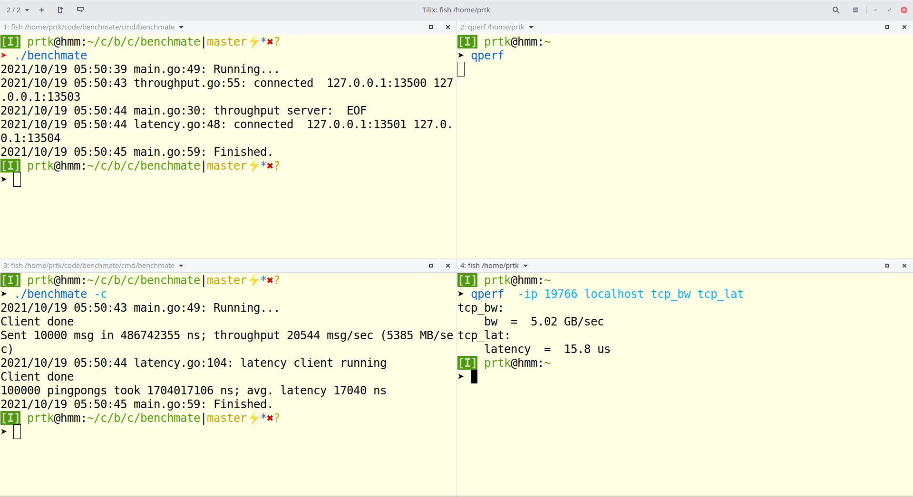

## benchmate

- You can get `benchmate` by

```
    cd cmd/benchmate/
    go build -o benchmate
```

- It can run in two modes
    - Server.
    - Client when your run it with `-c` arg. Client send data to server and calculates stats.
- So you can run server (`./benchmate`) in one place and client (`./benchmate -c`) in another. If the networking is all
  set you will get stats at the client.
- Details:
    - Server listens at fixed (customizable) ports for calculations. Default 13500 for throughput and 13501 latency
      calculations.
    - Client also uses fixed (customizable) local ports for connecting to server. Default 13503 for throughput and 13504
      for latency calculations.
    - Fixing the ports make it easy to debug using tcpdump. Also, we have to expose only fixed ports if needed.
    - We get results comparable to qperf. See .

## uds-benchmate

- You can get `uds-benchmate` by

```
    cd cmd/uds-benchmate/
    go build -o uds-benchmate
```

- `benchmate -c` client doesn't work with Konnectivity. So this `uds-benchmate` is a `benchmate` client designed to work
  with Konnectivity proxy.
- It uses the code from `throughput` and `latency` packages for creating clients and calculation of the stats. The same
  code is used by `benchmark -c`.
- So you run `benchmate` server on a node and you run `uds-benchmate` somewhere else. You will get stats if `uds-benchmate` client can get connection to Konnectivity proxy.

## Packages

Packages `throughput` and `latency` contain functions that allow construction of clients and servers to benchmark uds,
tcp sockets for variety of setups.

## References

These programs are based on programs by Eli Bendersky (https://github.com/eliben). Original programs are in references
folder. 