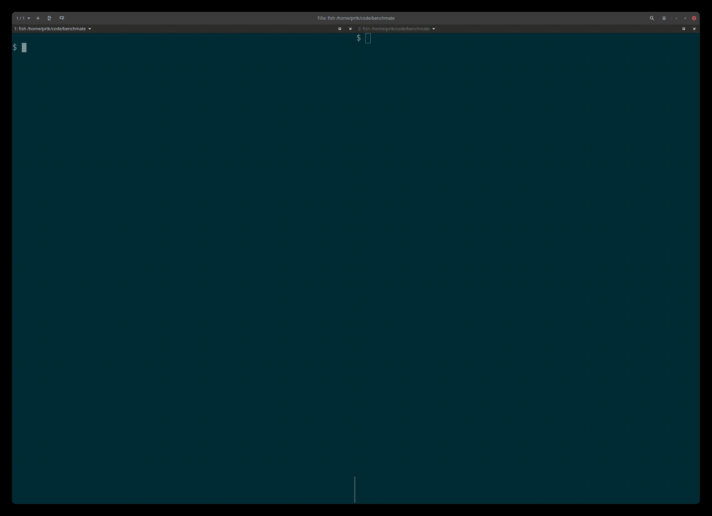
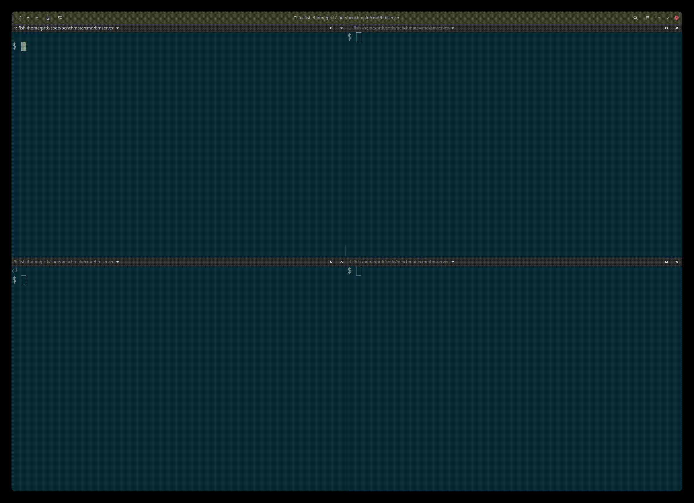

# Benchmate

## Overview
This repository contains 
1. Network latency, throughput estimation tools
   - `benchmate`: iperf3, qperf like tool to estiamte network throughput, latency.
   - `konnectivity-benchmate`: A client to measure throughput, latency of a [Konnectivity](https://kubernetes.io/docs/tasks/extend-kubernetes/setup-konnectivity/) setup.
2. Package that simplify construction of such tools. Read [documentation](https://pkg.go.dev/github.com/kubermatic/benchmate/). 
3. HTTP handlers to quickly add network performance estimation to your services. See [example](https://github.com/kubermatic/benchmate/blob/master/cmd/bmserver/main.go).


#### Benchmate
`benchmate` measures latency and throughput between two nodes. You can run it on one node in the server mode and on
another node in the client mode. If the the client and server can talk to each other, you should get the network
performance stats at the client. This tool supports both TCP and Unix Domain sockets. Quickest way to try this out is using the docker image. If you are go programmer, you can build it yourself from `cmd/benchmate` directory.  

Demo:

 

Commands from the demo:

```
# run server 
docker run --rm --network host quay.io/kubermatic-labs/benchmate
```

```
# run client
docker run --rm --network host quay.io/kubermatic-labs/benchmate -c
```

#### Konnectivity-benchmate
Client for benchmarking [Konnectivity](https://kubernetes.io/docs/tasks/extend-kubernetes/setup-konnectivity/). You can
run benchmark server on one node and point `konnectivity-benchmate` to the UDS of konnectivity proxy server.

#### Bmserver
This program demonstrates how you can easily add network performance estimation to your application. For example, if two
microservices are communicating over a network, you can measure the latency and throughput of the network. You register
HTTP handlers like [pprof](https://pkg.go.dev/net/http/pprof). 
```go
	mux := http.NewServeMux()
	mux.HandleFunc("/benchmate/throughput", bmHandler.Throughput)
	mux.HandleFunc("/benchmate/latency", bmHandler.Latency)
	log.Fatal(http.ListenAndServe(addr, mux))
```

You can then trigger handler on one service to run the
server and on the other service to run the client.

Demo:



Commands from the demo:

```
# run the latency server 
curl http://localhost:8888/benchmate/latency --data '
{
    "msgSize": 128,
    "numMsg": 1000,
    "network": "tcp",
    "addr": ":13501",
    "timeout": 120000
}
'
``` 

```
# run the latency client 
curl http://localhost:9999/benchmate/latency --data '
{
    "msgSize": 128,
    "numMsg": 1000,
    "network": "tcp",
    "addr": ":13501",
    "timeout": 120000,
    "client": true
}
'
```


## Troubleshooting

If you encounter issues [file an issue][1] or talk to us on the [#kubermatic channel][12] on the [Kubermatic Slack][15].

## Contributing

Thanks for taking the time to join our community and start contributing!

Feedback and discussion are available on [the mailing list][11].

### Before you start

* Please familiarize yourself with the [Code of Conduct][4] before contributing.
* See [CONTRIBUTING.md][2] for instructions on the developer certificate of origin that we require.
* Read how [we're using ZenHub][13] for project and roadmap planning

### Pull requests

* We welcome pull requests. Feel free to dig through the [issues][1] and jump in.

## Changelog

See [the list of releases][3] to find out about feature changes.

## References

These programs are based on programs by Eli Bendersky (https://github.com/eliben). Original programs are in references
folder.


[1]: https://github.com/kubermatic/benchmate/issues

[2]: https://github.com/kubermatic/benchmate/blob/master/CONTRIBUTING.md

[3]: https://github.com/kubermatic/benchmate/releases

[4]: https://github.com/kubermatic/benchmate/blob/master/CODE_OF_CONDUCT.md

[11]: https://groups.google.com/forum/#!forum/kubermatic-dev

[12]: https://kubermatic.slack.com/messages/kubermatic

[13]: https://github.com/kubermatic/benchmate/blob/master/Zenhub.md

[15]: http://slack.kubermatic.io/

