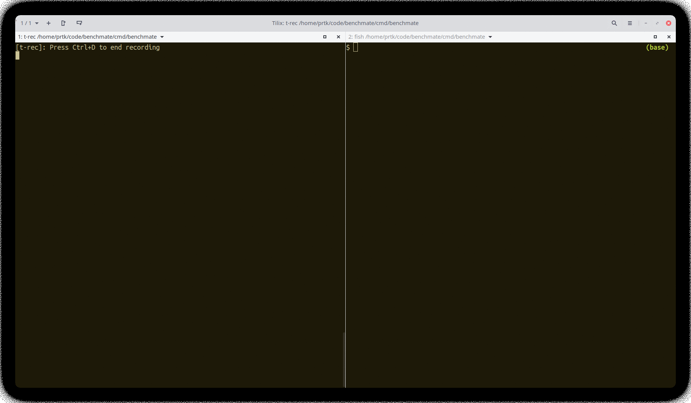
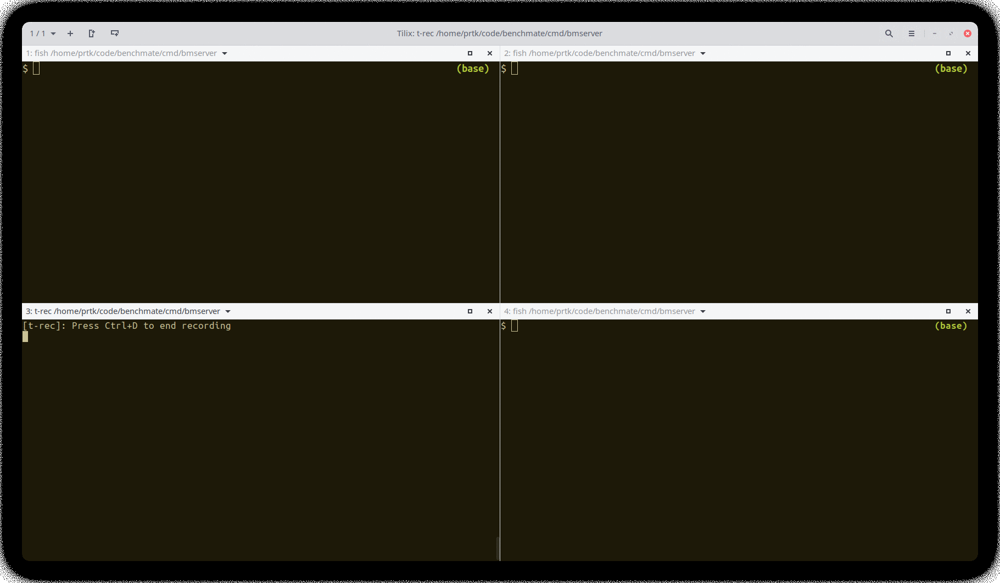

# Benchmate

## Overview
This repository contains various network benchmarking tools, packages that simplify construction of such tools and
handlers to quickly add network benchmarking functionality to your services.

## Tools

There are three tools:
- [benchmate](#cmdbenchmate) -- a tool to run network benchmarks
- [konnectivity-benchmate](#cmdkonnectivity-benchmate)-- client for benchmarking Konnectivity using benchmate. 
- [bmserver](#cmdbmserver) -- a toy. 

### [cmd/benchmate](cmd/benchmate)
`benchmate` measures latency and throughput between two nodes. You can run it on one node in the server mode and on
another node in the client mode. If the the client and server can talk to each other, you should get the network
performance stats at the client. This tool supports both TCP and Unix Domain sockets. You can specify parameters 
for the benchmark using json files via `--latOpt=<filename>` for latency options and `--tpOpt=<filename>` for throughput options. Read the docs for details of the supported parameters.  

**Run it on localhost:**

 

**Run on two nodes in a cluster using docker:**


_On one node run server:_

tpOpt.json:
```
{
    "msgSize": 250000,
    "numMsg": 10000,
    "tcpAddress": ":13500",
    "timeout": 120000
}
```

latOpt.json:
```
{
    "msgSize": 128,
    "numPings": 1000,
    "tcpAddress": ":13501",
    "timeout": 120000
}
```
Command:
```
docker run -it --rm --network host -v $(pwd):/opts \
    quay.io/kubermatic-labs/benchmate:latest \
    --latOpt=/opts/latOpt.json \
    --tpOpt=/opts/tpOpt.json
```

_On another node run client:_

tpOpt.json:
```
{
    "msgSize": 250000,
    "numMsg": 10000,
    "tcpAddress": "<IP OF SERVER HERE>:13500",
    "clientPort": 13503,
    "timeout": 120000
}
```

latOpt.json:
```
{
    "msgSize": 128,
    "numPings": 1000,
    "tcpAddress": "<IP OF SERVER HERE>:13501",
    "timeout": 120000
}
```
Command:
```
docker run -it --rm --network host -v $(pwd):/opts \
    quay.io/kubermatic-labs/benchmate:latest -c \
    --latOpt=/opts/latOpt.json \
    --tpOpt=/opts/tpOpt.json
```


### [cmd/konnectivity-benchmate](cmd/konnectivity-benchmate)
Client for benchmarking [Konnectivity](https://kubernetes.io/docs/tasks/extend-kubernetes/setup-konnectivity/). You can
run benchmark server on one node and point `konnectivity-benchmate` UDS of konnectivity proxy server.

### [cmd/bmserver](cmd/bmserver)
This program demonstrates how you can easily add network perf measurement to your application. For example, if two
microservices are communicating over a network, you can measure the latency and throughput of the network. You register
HTTP handlers like [pprof](https://pkg.go.dev/net/http/pprof). 
```go
	mux := http.NewServeMux()
	mux.HandleFunc("/benchmate/throughput", bmHandler.Throughput)
	mux.HandleFunc("/benchmate/latency", bmHandler.Latency)
	log.Fatal(http.ListenAndServe(addr, mux))
```

You can then trigger handler on one service to run the
server and on the other service to run the client.

**Demo on localhost:**



Commands for you to try. There are more in [curls.txt](./hack/curls.txt).
```
$ curl http://localhost:8888/benchmate/latency --data '
{
    "msgSize": 128,
    "numPings": 1000,
    "tcpAddress": ":13501",
    "timeout": 120000
}
'

$ curl http://localhost:9999/benchmate/latency --data '
{
    "msgSize": 128,
    "numPings": 1000,
    "tcpAddress": ":13501",
    "timeout": 120000,
    "client": true
}
'
```

## Packages
Packages `throughput` and `latency` contain functions that allow construction of clients and servers to benchmark uds,
tcp sockets for variety of setups.

## Troubleshooting

If you encounter issues [file an issue][1] or talk to us on the [#kubermatic channel][12] on the [Kubermatic Slack][15].

## Contributing

Thanks for taking the time to join our community and start contributing!

Feedback and discussion are available on [the mailing list][11].

### Before you start

* Please familiarize yourself with the [Code of Conduct][4] before contributing.
* See [CONTRIBUTING.md][2] for instructions on the developer certificate of origin that we require.
* Read how [we're using ZenHub][13] for project and roadmap planning

### Pull requests

* We welcome pull requests. Feel free to dig through the [issues][1] and jump in.

## Changelog

See [the list of releases][3] to find out about feature changes.

## References

These programs are based on programs by Eli Bendersky (https://github.com/eliben). Original programs are in references
folder.


[1]: https://github.com/kubermatic/benchmate/issues

[2]: https://github.com/kubermatic/benchmate/blob/master/CONTRIBUTING.md

[3]: https://github.com/kubermatic/benchmate/releases

[4]: https://github.com/kubermatic/benchmate/blob/master/CODE_OF_CONDUCT.md

[11]: https://groups.google.com/forum/#!forum/kubermatic-dev

[12]: https://kubermatic.slack.com/messages/kubermatic

[13]: https://github.com/kubermatic/benchmate/blob/master/Zenhub.md

[15]: http://slack.kubermatic.io/

